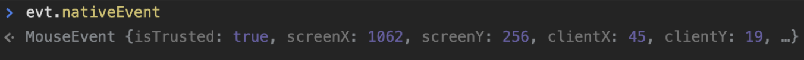

<link rel="stylesheet" type="text/css" media="all" href="./styles.css" />

<t>CoderHouse - React</t>

---

## Índice

- [C1 - Nivelacion](#c1)
    - [HTML](#c1)
- [C2 - Instalacion y configuracion del entorno](#c2)
    - [Comandos npm](#c2)
    - [create-react-app](#c2a)
- [C3 - Webpack y jsx](#c3)
    - [Sugar Syntax](#c3)
    - [Retrocompatibilidad](#c3a)
    - [jsx](#c3b)
- [C4 - Componentes](#c4)
    - [Componentes de presentacion](#c4a)
    - [Componentes contenedores](#c4b)
    - [Children](#c4c)
- [C5 - Componentes II](#c5)
    - [State hook](#c5a)
    - [Effect hook](#c5b)
    - [Actividad: Click tracker](#c5c)
- [C6 - Promises, asincronía y MAP](#c6)
    - [function `setTimeOut()`](#c6a)
    - [Método `.map()`](#c6b)
- [C7 - Consumiendo APIs REST](#c7)
    - [Paradigmas](#c7)
    - [Request via HTTP/S](#c7a)
        - [Verbo](#c7a1)
        - [Params](#c7a2)
        - [Headers](#c7a3)
        - [Body](#c7a4)
    - [Request API MercadoLibre](#c7b)
    - [Request en el browser](#c7c)
        - [cors](#c7c1)
- [C8 - Routing y navegacion](#c8)
- [C9 - Eventos y declaraciones](#c9)
    - [Tipos de eventos](#c9)
    - [DOM Events](#c9a)


# HTML

## DOCTYPE 

No es una etiqueta, sino una instrucción para indicar al navegador qué versión de HTML vamos a utilizar. 
El DOCTYPE mostrado en nuestro ejemplo anterior es del estándar HTML 5.

```html
<!DOCTYPE html>
```

Se pueden incorporar modos en el tag de DOCTYPE, que cambian la forma en que el navegador interpreta.

## Metadatos del documento

`<title>`: 

Define el título del documento, el cual se muestra en la barra de título del navegador o en las pestañas de página.

`<base>`: 

Define la URL base para las URLs relativas en la página.
Refiere a cual es cuando usamos una url cual es la url de inicio
Permite definir desde que url base van a consumir los recursos

`<link>`: 

Utilizada para enlazar JavaScript y CSS externos.

`<meta>`: 

Con esta etiqueta definimos la codificación que tendrá nuestro archivo, los mismos pueden ser:

- UTF-8 ✓ recomendado
- ANSI

> ANSI es el formato estándar de codificación de archivos utilizados en el Bloc de notas.

## Scripting

`<script>`: 

Define tanto un script interno como un enlace hacia un script externo. El lenguaje de programación es JavaScript

`<noscript>`: 

Define un contenido alternativo a mostrar cuando el navegador no soporta scripting.
Define comportamiengo cuando no hay script

## Javascript

> ### 💡
> Destructuracion:
> cuando agarro las propiedades de un objeto y las capturo en otro

Podemos declarar variables de una propiedad de un objeto en la destructuracion:

#### 📜 Ejemplo!

```js
let obj = {
    nombre: "lili",
    ocupacion: "developer",
    edad: 30
}
let {nombre: nom,ocupacion} = obj;
console.log(nom); //aparece el contenido de nombre

//tambien podemos

const leerNombre = ({nombre, ocupacion}) =>{
    console.log(`Tu nombre es ${nombre} y te dedicas a ser ${ocupacion}`);
}
leerNombre(obj);
```

otro ejemplo

Aqui creamos 2 variables, la primera con el primer valor del array y la segunda con el segundo valor del array

```js
const [primerValor, segundoValor] = [1,2]

console.log(`Aqui sale el uno ${primerValor} y aqui el dos ${segundoValor}`);

//Aqui sale el uno 1 y aqui el dos 2
```

> ### 💡
> Arrow function
> Arrastra el contexto de donde fue ejecutada

<a id='c2'></a>

# C2 - Instalacion y configuracion del entorno

## Comandos npm

Una vez instalado node tenemos el comando

```
node
```

Para ver la version

```
node -v
```

Si trabajamos con varias versiones de node descargamos nvm y listamos las versiones con:

```
nvm ls
```

Para inicializar un proyecto en node

```
npm init
```

### Dependencias en package.json

Para instalar dependencias

```
npm install nombre-dependencia
```

Para instalar las dependencias que esten en el proyecto package.json

```
npm install
```

Para desinstalar dependencias

```
npm unistall nombre-dependencia
```

Instalar dependencias en modo de desarrollo

```
npm install nombre-dependencia --save-dev 
```

**Para dejar limpios los node_modules que no estemos usando**

```
npm prune
```

Para publicar el codigo que hacemos en npm
 
```
npm publish
```

**Para instalar paquetes de manera global** Con este comando instalamos la herramienta en todo el terminal, esto disponibiliza el comando en cualquier lugar, no en un projecto en particular, si no en la version de node que estemos corriendo

```
npm install --g nombre-dependencia
```
> No estan recomendados los paquetes globales

Podemos usar npx, la `x` viene de *execute*, permite bajar y ejecutar en el mismo momento, seria hacer el install global y la ejecucion.

```
npx nombre-dependencia nombre-del-proyecto
```

> ### 💡
> Las dependencias de desarrollo son aquellas que no se van a exportar con el proyecto final si no que solo van a servir para el desarrollo de la herramienta

### scripts en package.json

Son palabras que nos permiten simplificar el proceso

#### 📜 Ejemplo!

```json
"scripts":{
    "coderscripts":"node index.js"
}
```

en consola ponemos `coderscripts` y se ejecutara `node index.js`

<a id='c2a'></a>

## create-react-app

La libreria `create-react-app` es una aplicacion que permite crear un *scaffold* es la estructura con todo lo que necesito para poder inicial un proyecto en algo

### Ejecucion 1

Instalandolo de manera global:

```
npm install --g create-react-app
```

```
create-react-app nombre-del-proyecto
```

### Ejecucion 2

Ejecutando la libreria

```
npx create-react-app nombre-del-proyecto
```

## Levantamos la aplicacion

```
npm run start
```

Esto arma un *scaffold* de react


## Convenciones

- Un directorio normal, las que no son componentes las ponemos en minuscula

ruta: src/components

mkdir: /components

- Por cada componente hacemos una carpeta nueva, las carpetas que tegan componentes las inicializamos con mayusculas

ruta: src/components/Saludar

mkdir: /Saludar

creamos el componente:

ruta: src/components/Saludar/Saludar.js

Saludar.js

> ### 💡
> control k f
> Con el codigo seleccionado; organiza todo el codigo
>
> control p
> Podemos buscar un archivo en el visual

<a id='c3'></a>

# C3 - Webpack y jsx

## Sugar Syntax

Sugar Syntax refiere a la sintaxis agregada a un lenguaje de programación con el objetivo de hacer más fácil y eficiente su utilización. 

Favorece su escritura, lectura y comprensión.

#### 📜 Ejemplos!

```js
i = i + 1	→   i++
```

- ternary operator

```js
const condition = true;
console.log(`This is ${condition ? 'correct' : 'incorrect'}`);
```

- Spread operator 

Spread = desplegar

```js
[a, ...arr]
```

```js
const array = [1,2,3,4,5];
const arr2 = [6,7,8,9,10, ...array];
console.log(arr2);
//[6,7,8,9,10,1,2,3,4,5]
```

```js
const obj = { nombre: 'coder'};
const obj2 = { ocupacion: 'codear', ...obj}
console.log(obj2);
// Object { ocupacion: "codear", nombre: "coder" }
```

- Propiedades dinámicas

```js
{ foo: "bar", [ "baz" + id ]: 42 }
```

Si no conocemos las propiedades del objeto al momento de crearlo; el nombre de la key.

```js
const obj = { nombre: 'coder'};
const num = 1;
const obj2 = {
    ocupacion: 'coder',
    //Crea una propiedad en el momento para poder computar
    ["test" + num]: 'dynamic',
    ...obj
};
console.log(obj2);
//Object { ocupacion: "coder", test1: "dynamic", nombre: "coder" }
```

- Deep matching

```js
var { a: val } = { a : 2 }
```

- Asignación en desestructuración

Ponemos un valor por defecto en caso que no haya un valor en la destructuracion

```js
var [ a = 1, b = 2, c = 3, d ] = [ 4, 5 ]
```

<a id='c3a'></a>

## Retrocompatibilidad - pollyfills

Los polyfills nos permiten hacer nuestra aplicación compatible con navegadores antiguos que no admiten de forma nativa alguna nueva funcionalidad

**¿Cómo se integra un polyfill?**

Ejemplo: core-js

`zloirock/core-js: Standard Library`

```
npm install --save core-js@3.6.5
```

se agrega a la lista de dependencias

<a id='c3b'></a>

## JSX - javascript xml

JSX es una extensión de Javascript, no de React. 

Esto significa que no hay obligación de utilizarlo, pero es recomendado en el sitio web oficial de React. 

#### 📜 Ejemplo!

```jsx
<div className="active">Hola Coders</div>
```

```js
React.createElement(
    'div', 
    { className: 'active'}, 
    'Hola Coders');
```

### Reglas generales

Los elementos deben ser balanceados. 

Por cada apertura debe haber un cierre.

```js
 //Mal
</img> //Es mejorable
```

Si el elemento no tiene hijos, debe idealmente ser auto-cerrado

```js
 //Ideal
```

<a id='c4'></a>

# C4 - Componentes

Los componentes permiten separar la interfaz de usuario en piezas independientes, reutilizables y pensar en cada pieza de forma aislada.


Tienen responsabilidades muchas veces mayores muchas otras menores, dependiendo del contexto

>### 👍🏼 Ventajas
> ✅ Favorece la separación de responsabilidades: cada componente debe tener una única tarea.
> ✅ Al tener la lógica de estado y los elementos visuales por separado, es más fácil reutilizar los componentes.
> ✅ Se simplifica la tarea de hacer pruebas unitarias.
> ✅ Puede mejorar el rendimiento de la aplicación.
> ✅ La aplicación es más fácil de entender. 

Los componentes idealmente deberian tener una sola responsabilidad:

## prop

Le damos informacion al componente para que pueda hacer algo

Las propiedades son la forma que tiene React para pasar parámetros de un componente superior a sus children.

Es la manera de implementar el flujo de datos unidireccional

Si alguna prop es una función, el child component puede llamarla para provocar efectos secundarios en el parent

- No están limitadas a ser valores fijos como: 1 / “Alexis” / true
- Pueden ser lo que sea:

✅ **Valores comunes** num, bool, array, obj

✅ **Funciones**

✅ **Componentes**  Si los componentes son funciones, ¡entonces puedo pasar componentes! ;)

✅ **Children**

✅ **Valores inyectados por librerías** location, rutas, traducciones


### En componentes de clase:

Las propiedades enviadas al componente las recibiremos a través de this.props para acceder a un objeto en el cual tendremos todas las propiedades disponibles.

> Con las clases es muy dificil compartir el comportamiento

### En componentes funcionales

Simplemente se reciben como parámetro de la función

```js
({ name }) => <p>{name}</p> 
```

<a id='c4a'></a>

## Componentes de presentacion

Son aquellos que simplemente se limitan a mostrar datos y tienen poca o nula lógica asociada a manipulación del estado (por eso son también llamados stateless components). 

- Orientados al aspecto visual
- No tienen dependencia con fuentes de datos (ej. Flux)
- Reciben callbacks por medio de props
- Pueden ser descritos como componentes funcionales
- Normalmente no tienen estado

#### 📜 Ejemplo!


Usando esta sintaxis, las propiedades se reciben como parámetros de la función y podemos obtener las variables que nos interesan por separado

```js
const Titulo = ({nombre}= props)=>(
    <h1>{nombre}</h1>
);

const Item = (props) =>(
    <li><a href="#">{props.valor}</a></li>
);

const Input = (props)=>(
    <input type='text' placeholder={ props.placeholder} />
);
```

<a id='c4b'></a>

## Componentes contenedores

Tienen como propósito encapsular a otros componentes y proporcionarles las propiedades que necesitan. Además se encargan de modificar el estado de la aplicación para que el usuario vea el cambio en los datos (por eso son también llamados *state components*).

- Orientados al funcionamiento de la aplicación
- Contienen componentes de presentación y/u otros contenedores 
- Se comunican con las fuentes de datos 
- Usualmente tienen estado para representar el cambio en los datos

#### 📜 Ejemplo!


> ### 💡
> Este tipo de componentes será el encargado de realizar llamadas a las API’s externas y/o establecer la lógica a realizar en función de las acciones que realice el usuario sobre la interfaz.

<a id='c4c'></a>

## Children

Children es una manera que tiene react de permitirnos proyectar/transcluir uno o más componentes dentro otro

```js
<Component>
    <ChildComponent/>
</Component>
```


**Es ideal cuando:**

- Necesitamos que un elemento quede dentro de otro sin que sepan el uno del otro
- Necesitamos implementar patrones más complejos

Cuando le decimos react donde ubicar el `children`


Cuando enviamos varios `children` y queremos ordenarlos cada uno en particular


<a id='c5'></a>

# C5 - Componentes II

## Relacion de `children` y `props`

Si le agregamos `children` en el jsx:

Los inyecta como objeto si es único o como array si son muchos.

> ### 💡
> Tener cuidado para evitar errores del tipo `children[0]`, si espero un grupo de children y viene uno solo, cuando hay un único child de tipo `object`.
> asi evitamos el error indexoutoffboundexception

## Hooks

<a id='c5a'></a>

## State hook

Cuando queremos traer informacion de react; por ejemplo de un formulario, podemos usar `useState`


```js
import React, { useState } from 'react';

const [name, setName] = useState(null);
```

El primer parametro nos devuele un lugar para almacenar el estado en este ejemplo `name`, y en el segundo parametro una funcion con el cual editar este estado `setName`.

Con el uso de un manejador de eventos *EventListeners* puedo modificarlos. Por ejemplo un `onClick` `onInput`

> ### 💡
> Conectar el estado con un evento es databinding 

> #### 🎬
> Video: Clase 5 minuto 43 ejemplo submit formulario y hooks

Este hook lo que hace es guardar esta informacion; este estado fuera de la funcion, ya que cuando hacemos setName la funcion se vuelve a ejecutar, y esto ocurre en cada cambio de prop y en cada cambio de estado

### Estructura básica:

Los declaramos con *spread syntax* para simplificar


#### Reglas:

- El value es constante
  No puedo hacer `name = x`

- Se cambia con `setName`
  setName(‘Nuevo valor’)

- No llamar `setName` entre la declaración del hook y el render


#### 📜 Ejemplo: Click tracker

```js
import {useState} from 'react';

export default function App() {
  const [click, setClick] = useState(0);

  function handleClick(){
    setClick(click + 1);
  }

  return (
    <div className="App">
      <h1>Prueba click tracker</h1>
      <button onClick={handleClick}>Click</button>
      <p>{click}</p>
    </div>
  );
}

```

Agregamos la hora del ultimo click

```js
import {useState} from 'react';

export default function App() {
  const [click, setClick] = useState(0);
  const [lastClick, setLastClick] = useState('null');

  function handleClick(){
    setClick(click + 1);
    setLastClick(new Date().toTimeString());
  }

  return (
    <div className="App">
      <h1>Prueba click tracker</h1>
      <button onClick={handleClick}>Click</button>
      <p>{click}</p>
      <p>{lastClick}</p>
    </div>
  );
}

```

<a id='c5b'></a>

## Hook de efecto / useEffect

El hook de efecto sirve para: 

1. controlar el ciclo de vida
2. controlar las mutaciones (props, estado); 

Cuando un componente se inicia, cuando cambia una propiedad, cuando cambia de estado y cuando se desmonta.

Piénsalo como un filtro:

```js
useEffect(fn, filter)
```

Su estructura:

- Su primer parametro la funcion 
- Su segundo parametro: El como se comporta ese hook `[]);` que es un array vacio


> Los efectos se producen despues del acto de montaje

### Variantes

|Variantes/filtros|    |
|------|---------|
|`[ ]` | On mount|
|`[prop]`| On mount y por cada cambio de prop|
|`[prop1, prop2]`|On mount y en cada cambio en prop1 o prop2, pueden ser varias props|
|`undefined`|useEffect(()=>{}) => Mount y en cada render|

> ### 💡
> Al inicializar un componente se ejecutan todos los hooks

#### 📜 Ejemplo orden ejecucion hooks effect


### render effect

Si hay varios render effect se ejecutan en orden

```js
useEffect(()=>{
    console.log('Se renderiza siempre');
})
```

> ### 💡
> Se ejecuta al inicio y al renderizar

### initialize effect 

Se ejecuta al inicio / se ejecuta al montar
Se pone arriba ya que se ejecuta una unica vez

**En este efecto se llaman los recursos:** ej firebase

```js
useEffect(() => {
    console.log('Se ejecuta en el montaje');
}, []);

```

> ### 💡
> Se ejecutan al inicio y al montar

### change effect

Escucha cambios en los estados, ponemos de ejemplo que escucha clicks

**Cuando ocurren cambios como sincronizar con la base de datos se hace en este estado**

```js
useEffect(() => {
  console.log('Escucho cambios en el estado de clicks');

}, [clicks])

```

```js
useEffect(() => {
  console.log('Escucho cambios en el estado de clicks');

}, [clicks, date])

```
> ### 💡
> Se ejecuta al inicio y al cambiar el estado

## useParams

Agarra los parametros

## Cleanup

**A este efecto le podemos declarar una limpieza del efecto.**
Siempre que algo vaya a cambiar hay que hacer algo antes.
React deja ejecutar una funcion, antes que react renderice 


Si devuelves una función 

```js
return () => {}
```

se ejecutará el clean que quieras (ajax call, remover una suscripción, librería, etc)

```js
useEffect(() => {
  console.log('Renderizando');

  return () => {
    console.log('Limpieza');
  }
})

```

La manera de hacer una limpieza es devolviendola del mismo callback del hook

✅ Permiten mantener la consistencia de las respuestas

> ### 💡
> Por cada efecto hay una limpieza

> #### 🎬
> Video: Explicacion limpieza min 1:29

> ### 💡 Importante
> **Tanto los callbacks como los cleanups:**
> - Se ejecutan en el orden en que se hayan declarado los otros hooks respectivos
> - Recuerda que la función se destruye en cada ejecución, si tienes actividad pendiente hay que cerrarla en cada cleanup y volver a suscribirla

Los hooks se comportan simétricamente tanto con los valores observados props como con el state

>### ✅
> Acción => Limpieza => Acción => Limpieza 

> ### ❌
> Acción => Acción => Acción => Limpieza

Cualquier acción en un effect tiene una acción opuesta de limpieza, que será ejecutada antes de poder volver a ejecutar la acción.


✅ Toda acción del effect-hook se ejecuta al montar

✅ Ningún efecto bloquea el render

✅ Todas las acciones y limpiezas se realizan en orden

✅ Si modifico el state incluido en los filtros propios habrá un loop infinito

<a id='c5c'></a>

> ### [📌Actividad: Click tracker](./Actividades/clickTracker.js)


<a id='c6'></a>

# C6 - Promises, asincronía y MAP

## Promise

JavaScript tiene una API que nos permite crear y ejecutar distintas operaciones o conjuntos de operaciones. 

Una Promise (promesa en castellano) es un objeto que permite representar y seguir el ciclo de vida de una tarea/operación (función)

> Una promise no es asincronica 

> #### 🎬
> Video: Explicacion min 10:00
 
### Estados posibles:

**PENDING => (FULLFILLED || REJECTED)**
PENDIENTE => (COMPLETADA || RECHAZADA)


Usaremos `.then` para ver el resultado del cómputo de la tarea.

> ### 💡
> Algo interesante:
> Todos los operadores `then` y ``catch` son encadenables.
> `.then().catch().then().then()`

En algunos navegadores ya tendremos disponible el `.finally()`, que lo podemos llamar al final de la cadena para saber cuando han terminado tanto los completados como los rechazos

`fallback` es un valor suplente, como un backup, algo que devolvemos en vaso que pase algo y necesitamos un suplente.

### Garantías de una -Promise-

- Las funciones callback nunca serán llamadas previo a la terminación de la ejecución actual del bucle de eventos en JavaScript.
- Las funciones callback añadidas con .then serán llamadas después del éxito o fracaso de la operación


#### 📜 Ejemplos de manejo de promesas

En este caso la promesa es exitosa y el error lo cometo en el primer `.then`, entonces de esta manera el error se captura con el `.catch`. Este tipo de errores ocurre donde fallamos al procesar el resultado

```js
const task = new Promise(
  (resolveFn, rejectFn) =>{
    //Resultado exitoso
    resolveFn(1000);
  }
);

task.then(
  result =>{
    console.log('Resultado: '+result);
    //Si el error lo cometo aqui
    throw new Error('Esto es un error');
  },
  err =>{
    //O el error lo cometo aqui
    console.log('Error: '+err);
  }
).catch(
  //El error se detecta aqui
  err =>{
    console.log('Error: '+err);
    return 
  }
)

```

En el siguiente caso el error ocurrio en el resultado de la promesa, entonces el error se detecta en `.err`

```js
const task = new Promise(
  (resolveFn, rejectFn) =>{
    //Aqui se detecta un error
    rejectFn('Aqui paso un error');
  }
);

task.then(
  result =>{
    console.log('Resultado: '+result);
  },
  err =>{
    //Entonces se captura aqui
    console.log('Error: '+err);
  }
).catch(
  err =>{
    console.log('Error: '+err);
  }
)

```

Otro caso puede ser:

```js
const task = new Promise(
  (resolveFn, rejectFn) =>{
    //Se resuelve la tarea
    resolveFn('Aqui paso un error');
  }
);

task.then(
  result =>{
    //Aqui hay un error
    throw new Error('Se produjo un error aqui')
    console.log('Resultado ok: '+result);
  },
  err =>{
    console.log('Error: '+err);
  }
).catch(
  err =>{
    //Se recibe el error
    console.log('Problema en lectura del resultado');
    //Puedo retornar un valor por defecto
    return 'default_value'
  }
).then(
  fallback=>{
    console.log(fallback);
  }
)
```

<a id='c6a'></a>

## function `setTimeOut()`

Encola la funcion que se le ponga dentro, permite agendar cosas para hacerla en el futuro
hace que la funcion se ejecute luego de todo el codigo y ademas podemos agregarle tiempo extra

```js
setTimeout(
  ()=>{

  }
)
```

Con tiempo extra

```js
setTimeout(
  ()=>{

  },1000
)
```

#### 📜 Ejemplo!

Crear una promesa que resuelva en tres segundos un array de objetos de tipo producto. Al resolver, imprimirlos en consola.

```js
{ id: string, name: string, description: string, stock: number }
```

> ### 💡
> **Solucion:** 
>
> [📌Actividad: Promesa en 3 segundos](./Actividades/promises.js)
>
> En el mismo tambien busco un articulo en especifico por id

<a id='c6b'></a>

## Método `.map()`

El método `map()` nos permite generar un nuevo array tomando de base otro array y utilizando una función transformadora

Es particularmente útil para varios casos de uso.

#### 📜 Ejemplos!

### [📌 Ejemplo: map](./Actividades/map.js)

### [📌 Ejemplo: map en productos](./Actividades/mapProductos.js)

### Método `.map()` en react

En react, con el método map, podremos hacer render de una colección de objetos. 

Elementos de un array lo podemos convertir en elementos del DOM

**Por ejemplo:**

```js
function App(){
  return <ul>
    {["Lili","Ospina"].map(
      elemento => <li>{elemento}</li>
    )}
  </ul>
}
```

Idealmente debemos incluir en cada elemento la propiedad 
`key`, que marque la identidad del elemento. Esto ayudará a react a optimizar el rendering ante cambios en el array

De no tenerla podemos auto-generarla con el index provisto por el segundo parámetro de map, pero sólo optimizará si hay adiciones al final del array.

```js
function App(){
  const [users, setUsers] = useState([
    {
      id:1,
      name: "Lili"
    },
    {
      id:2,
      name: "Ospina"
    },
  ])
  return <ul>
    {users.map(
      elemento => <li key={elemento.id}>{elemento.name}</li>
    )}
  </ul>
}
```

#### 📜 Ejemplo!

> ### [📌Actividad: Renderizar productos con React ](./Actividades/renderProductos.js)


>### 📌 Nota!
> **`async await`**
> 

<a id='c7'></a>

# C7 - Consumiendo APIs REST

Una API es una interfaz avanzada de programacion, **es un conjunto de funciones que nos permiten usar una libreria**

Es un conjunto que funcionalidades que yo puedo utilizar, proveida por una aplicacion.
Es una manera de exponer sus funcionalidades.

## Paradigmas de intercambio de información

### Modelo cliente-servidor

Este modelo establece que los distintos consumidores se identifican entre ellos y acuerdan una manera de transferir la información.

Lo más importante a recordar es que la variación más notable que podemos identificar queda definida por: 

**¿Quién es el que inicia la operación y cómo sincronizan?**

✅ El cliente inicia:

1. El cliente solicita info
2. El servidor envía la respuesta
3. Fin de la comunicación

### Push

Si invertimos la lógica, se la conoce como PUSH

Cuando aplicaciones te hacen push para que vuelvas a la app

✅ El servidor inicia:

1. Cliente se suscribe
2. El servidor elige el momento del inicio de la transferencia, y la envía a un servicio
3. El servicio se la provee al cliente

El servidor decir cuando manda notificaciones, el usuario acepta que le manden notificaciones

Push nace para poder generar engagement y lograr que los usuarios recuerden que nuestra app existe y que puede proveerles con algo que les pueda interesar, en el momento en el que el servidor considere oportuno

### Polling

Es un paradigma de sincronizacion, el servidor no me manda notificaciones como en push, si no que hace multiples request preguntandole al servidor si tiene cambios para él.

De no utilizar PUSH deberíamos configurar nuestros client para que estén constantemente preguntando:

¿Tienes algo nuevo para mi?
¿Tienes algo nuevo para mi?
¿Tienes algo nuevo para mi?

De manera indefinida sin optimizar los recursos/datos del usuario y nuestro servidor

> No es muy recomendado

### Socket

Es el que se recomienda y no lo dan en este curso

<a id='c7a'></a>

## Request via HTTP/S

Vienen para ayudarnos a realizar una solicitud a un servidor y nos permiten establecer un protocolo de transferencia definido por:

✅ Dirección/URL

✅ Verbo (`GET, POST, PUT, DELETE` +)

✅ Parámetros: vía query o url

✅ Headers

✅ Body (contenido en un POST)

<a id='c7a1'></a>

### Verbo

Nos permiten definir una manera de explicarle al servidor la dirección y nuestras intenciones:

- `GET`: Quiero obtener
- `POST`: Quiero crear
- `PUT`: Quiero crear o actualizar
- `PATCH`: Quiero alterar parcialmente
- `DELETE`: Quiero eliminar

<a id='c7a2'></a>

### Query params

Nos permiten incluir en la dirección información que se usa para especificarle al receptor parámetros para efectuar una búsqueda, son más comunes para buscar recursos que no tengo la seguridad de que existan

https://www.google.com.ar/search`?q`=coderhouse

**Se puede leer como:**

- busca en `google.com.ar`
- utilizando `https`…
- el recurso `search` (resultados de búsqueda) …
- que contengan la palabra (`q = query`) "coderhouse"

#### URL Query params

✅ Se separa la URL de los parámetros utilizando un signo de pregunta `?` 

✅ Cada parámetro tendra `key=value & key2=value2`

✅ Cada parámetro se puede separar por `&`


**📜 Ejemplo!**

http://url.com/find?type=order&id=1234

#### URL Params/Segment

Son una convención para incluir el identificador del recurso dentro de la misma url, son más comunes cuando ya se conoce el recurso específico que se buscará.

Meter la la informacion para acceder al recurso por medio de la url

**📜 Ejemplo! #1**

https://myapp.coder/student/1234

Se puede leer como: 

- busca en `myapp.coder`
- utilizando `https`…
- el recurso `student` 
- con id `1234`

**📜 Ejemplo! #2**

https://myapp.coder/student/1234/courses

Se puede leer como: 

- busca en `myapp.coder`
- utilizando `https`…
- el recurso `courses` 
- Únicamente para `student 1234`

> ### 💡
> Recurso + id + suberecurso de ese id

#### Recursos/RESTful

Cuando se crea y provee un servicio basado y pensado en términos de recursos y se respetan las convenciones de verbo/método y código de respuesta, estamos frente a un diseño arquitectural de tipo REST
Si además transferimos javascript o xml, es conocido como ajax.

Es la convencion/manera de organizar los recursos, orientando los servicios en recursos, proveyendo informacion

<a id='c7a3'></a>

### Headers

Se usan para:

✅ Definir las respuestas soportadas, requeridas o preferidas

✅ Agregar información extra

  - Auth tokens, cookies
  - Lenguaje preferido
  - Si acepta contenido cacheado

✅ Lo que quieras en forma de texto

Se usan para transferir credenciales

> Las request RESTful se hacen por XHR

<a id='c7a4'></a>

### Body

Se utiliza para transferir piezas de información entre el cliente y el servidor


<a id='c7b'></a>

## Request API MercadoLibre


```js
export default function App() {

  //lugar correcto para hacer una request
  //Efecto de montaje
  useEffect(
    ()=>{
      //fetch hace un get automaticamente a la api
      fetch('https://api.mercadolibre.com/sites/MLA/categories')
      .then(
        //trae una respuesta cuando la promesa se resuelva
        (response)=>{
          //Este json es una promesa, Con el segundo then acceso a la respuesta
          response.json().then(
            body=>{
              //Stringify nos deja ver que tiene un objeto adentro
              console.log('Categorias',JSON.stringify(body));
              
            }
          )
        }
      )
    },
    []
  )
}
```

Refactorizamos el código a:

> ### [📌Actividad: API RESTful - MercadoLibre](./Actividades/apiMeli.js)
>
> 

<a id='c7c'></a>

## Request en el browser

<a id='c7c1'></a>

## Cors

Al realizar un request nos podemos encontrar con este error/problema.

Es una limitacion que pone el navegador por seguridad

> #### 🎬
> Video: explicacion min 1:25

Nuestra app le hace un request al browser y el browser la hace un request a la app que queremos acceder.

Para esto el browser le manda un request que se llama `options` que se llama preflight, lo que espera es recibr un header al `Access-Control-Allow-Origin`
Si el sitio responde con el header `Access-Control-Allow-Origin` ocurre el request.

### preflight

Antes de enviar un request entre dominios como en el siguiente ejemplo, el browser envía un request OPTIONS llamado pre-flight


En este request se le pregunta al otro dominio si acepta requests provenientes de un dominio distinto (cross)


> ### 💡
> **`Cors`**
> Más que un problema es un bloqueo de seguridad efectuado por el navegador (Chrome, Mozilla, etc).

Esto es para que por default, el javascript alojado en un dominio misitio.com sólo pueda ejecutar llamados http hacia misitio.com. 
Esto previene algunos problemas de seguridad.


Usualmente ocurre cuando tengo un servidor para mi React App alojado en `https://localhost:3000` tratando de hacer un request contra una api levantada en `https://localhost:3001` u otrodominio.com


El modo de solucionarlo es configurar al otro servidor para que admita CORS respondiendo el siguiente header ante un OPTIONS preflight

```
Access-Control-Allow-Origin: * 
```
ó

```
Access-Control-Allow-Origin: https://localhost:3000
```


✅ Estos headers se deben activar ante un verbo OPTIONS, aunque por comodidad podemos también activarlos para otros verbos 

✅ Podemos activar uno o todos (*) los dominios

✅ Configurarlo bien nos puede ayudar a resolver algunos inconvenientes durante el desarrollo

### 👍🏼

- Los mejores servicios y/o integraciones proveen integraciones mediante API’s Rest usando http/s

- Son el canal transaccional más importante del mundo

- Nos conectan a soluciones que puedan complementar nuestro modelo de negocio y suman adoptabilidad

#### 📜 Ejemplo!

- GET <https://graph.instagram.com/{user-id}/media?access_token=123434>
(Nos permite leer información de users de instagram vía API)

- POST <https://api.mercadopago.com/v1/payments?access_token=123434>
(Nos permite usar http para habilitar el pago a nuestros usuarios)

<a id='c8'></a>

# C8 - Routing y navegacion

La facilidad con la que nuestra aplicación permite agregar funcionalidades y navegarlas es un factor clave en términos de experiencia y escalabilidad

>### 👍🏼 Buena navegabilidad permite a:
> **Users**: entender dónde están parados y guardar favs/marcadores a secciones en las que tienen interés
> **Navegadores**: Permitir controlar las acciones de ir adelante y volver, y conocer el nav history
> **Crawlers**: Entender la estructura de la app y proveer acceso optimizado/visibilizado a las distintas secciones

## Routing


Por defecto React no viene con un mecanismo integrado de navegación.

Esto es para mantener sus dependencias al mínimo y dado que no todo proyecto necesita routing, se maneja como una dependencia aparte.

Hay varias soluciones, pero hoy instalaremos:
`react-router-dom`

> ### 💡 Versiones
> Si bien instalaremos react-router-dom publicado en NPM, veremos varias versiones
> react-router => librería core (no instalar)
> react-router-dom => para routing en el browser
> react-router-native => para routing en react-native
> Y algunas otras...

importamos los modulos

### `Routes`

conjunto de rutas que adentro contiene rutas y cada ruta tiene un componente de react

#### Especificidad de match

✅ exact: 

Por defecto se matchean (coinciden) únicamente partes de la url, por lo tanto `/` va a matchear `/cart` o `/checkout`, a no ser que le digamos que use la propiedad `exact`

```js
<Routes>
  <Route exact path="/">
    <Home />
  </Route>
</Routes>
```

## Navegar a una ruta con parámetros

Si hacemos la ruta dinámica
(con parámetros) 

```js
<Route path="/categories/:categoriyId">
  <Home />
</Route>
```

### Navegar a una ruta - `NavLink`


> ### 💡
> `<NavLink />` permite ponerle estilos a los links

Un NavLink es un link con un estilo, está siempre detectando la ruta actual, y si coincide con la suya nos activa la clase que le demos para que el user sepa qué item de la lista corresponde con la vista actual

```js
<NavLink to={`/categories/${cat.id}` activeClassName="currentCategory" className="text-white">
{cat.name}
</NavLink>
```

### Recibir parámetros - por ruta

React router provee integración con Hooks.

#### Hook `useParams`:

Lo podemos utilizar para leer en js los parámetros de la ruta
En combinación con un useEffect nos sirve para obtener actualizaciones sobre los parámetros


> Podemos usar el mismo hook para capturar los cambios en la url

En este casi vigila el cambio del parametro y busca el item adecuado


> ### [📌 Ejemplo: getItem ](./Actividades/getItem.js)

<a id='c9'></a>

# C9 - Eventos y declaraciones

Es un estímulo programático que puede ser provocado de manera automática o ser el resultado de una interacción del usuario con la UI

## Tipos de eventos

### Eventos automaticos

Si estamos viendo Netflix por mucho tiempo sin tocar el control remoto ocurre un evento automático por inactividad que nos pregunta...


### Eventos manuales

Son todas las interacciones del usuario que producen algún tipo de respuesta o efecto secundario


<a id='c9a'></a>

## DOM Events

El DOM tiene una serie de eventos estándar y se dividen en varias categorías:

### Dispositivo/acción: 

`mouse, input, keyboard, wheel, focus`, etc

### Custom events: 

Es posible definir eventos propios que disparen la información que queramos


El evento de UI más conocido es el click

```js
return (
  <div>
  <button onClick={input}>Button</button>
  <p>Pressed?</p>
  </div>
)
```

Aunque probablemente lo utilices casi tanto como el scroll vía un `wheel event`

## Event listener

Son un patron de diseño

Un **Event Listener** es un patrón de diseño que sirve, como su nombre lo indica, para escuchar cuando un algo ocurre en algún:

✅ elemento, 

✅ librería o 

✅ API, 

y poder realizar una acción en consecuencia.

### Configurando Event Listeners


### Removiendo un Event Listener

```js
return ()=>{
  console.log('On dismount');
  window.removeEventListener(onResize)
}
```

✅ Se des-registran con el nombre y la referencia a la función con que los registramos (no alcanza únicamente el nombre)

✅ Si registras manualmente un evento del DOM en tu componente de react hazlo dentro de un effect y asegúrate de des-registrarlo en la función de limpieza en el return del efecto

✅ **Recordemos**: Si dejamos event listeners sin des-registrar corremos riesgos de crear leaks de memoria o registrar un evento más de una vez ( se ejecutara una vez por cada register )


> ### 💡
> Nota: Invocar el removeEventListener en la función de limpieza de nuestros hooks en donde los hayamos registrado

## React y los eventos

### Synthetic Events

Los distintos browsers suelen tener algunas variaciones en el contenido de los eventos.

Esto haría difícil utilizarlos de manera uniforme en cada plataforma. React es consciente de esto y nos ayuda proveyendo esta abstracción

✅ Sirven para normalizar/estandarizar eventos entre browsers

✅ Siempre que registre un evento vía React/Jsx con onClick, no obtendré el evento nativo, sino uno sintético

✅ Se destruyen al terminar la ejecución de la función vinculada (por performance)

✅ Puedo acceder al evento nativo via `evt.nativeEvent`

> Es una forma de React de darle estabilidad a los eventos entre navegadores




#### 📜 Ejemplos!

Evento `click` simple:

```js
export default function App() {

  //Siempre que declaremos un evento va a recibir un parametro
  function clickEvent(evt){
    console.log('Hello Li');
  }

  return (
    <div className="App">
      <button onClick={clickEvent}>
        Click
      </button>
    </div>
  );
}
```

Sincronizacion de un input con un estado:

```js
import React,{useState} from "react";

export default function App() {
  //El value del input lo guardamos en un estado
  const [valor, setValor] = useState("");

  //Siempre que declaremos un evento va a recibir un parametro
  function inputEvent(evt){
    console.log('Hello', evt.target.value);
    //En cada evento guardamos el valor
    setValor(evt.target.value)   
  }

  return (
    <div className="App">
      <input type="text" onInput={inputEvent} />
      <p>{valor}</p>
    </div>
  );
}

```

> ### 💡
> Si quiero que el input tenga por defecto un valor agregado
> Me conecto a la propiedad `value` y la onectamos a mi input
> Cuando se termina la funcion que invoca el event listener ese evento se destruye, por eso de ser necesario se guarda el valor en un estdado.


```js
import React,{useState} from "react";

export default function App() {
  //El value del input lo guardamos en un estado
  const [valor, setValor] = useState("lili");

  //Siempre que declaremos un evento va a recibir un parametro
  function inputEvent(evt){
    //En cada evento guardamos el valor
    console.log('Hello', evt.target.value);
    setValor(evt.target.value)
   
  }

  return (
    <div className="App">
      {/* Si quiero que el input tenga por defecto un valor agregado */}
      <input type="text" onInput={inputEvent} value={valor} />
      <p>{valor}</p>
    </div>
  );
}

```
Evento de la tecla presionada `onKeyPress`:
(Avisa cuando hay una tecla presionada)
hay 2 eventos `onKeyDown` `onKeyUp` esto se resumen en `onKeyPress`


Muestra la tecla presionada

```js
import React,{useState} from "react";

export default function App() {
  //El value del input lo guardamos en un estado
  const [valor, setValor] = useState("lili");

  function keyPressEvent(evt){

    //En cada evento guardamos el valor
    console.log('Hello', evt.target.value);
    setValor(evt.key)
    
  }

  return (
    <div className="App">
      <input type="text" 
        onKeyPress={keyPressEvent} 
        value={valor} />
      <p>{valor}</p>
    </div>
  );
}

```

## Cancelacion de eventos

Con `preventDefault()` evitamos el desarrollo del evento, prevenimos que el evento se propague.

Si le damos el `preventDefault()` a un `onKeyPress` lo que hacemos es que prevenimos que se ejecute la primera parte del evento, la del dedo presionando el boton, entonces si prevenimos el `keyDown` estamos previniendo el cambio en el input

## Evitando la propagacion

Los eventos por default se ejecutan en el elemento y en cada uno de sus ancestros. Si esto puede traer algún efecto secundario podemos cancelar la propagación (bubbling):

`evt.stopPropagation()`

## Suscripcion a un evento

> ### [📌Actividad: Evento Resized Window](./Actividades/eventResizedWindow.js)


Si queremos hacer esta logica en cualquier componente de mi aplicacion 

Si queremos saber la altura  y anchura en tiempo de real en distintos componentes, nos llevamos la logica a un `hook`

Cuando vemos

✅ estados

✅ eventos

✅ un efecto

✅ vemos cuando el componente se monta

> ### 💡
> El hook permite exponer los valores resultantes

Cada vez que hay un evento se modifica el estado y cuando cambia el estado hay un render, pasa todo de vuelta menos el efecto del montaje.

> ### [📌Actividad: Custome hook - Resized window](./Actividades/.md)

> ### [📌Actividad: Custom hook - Input](./Actividades/CustomeHookInput.js)

> ### [📌Actividad: Custom hook - Input dinamico](./Actividades/CustomeHookInputDinamico.js)

Evita escribir vocales

> ### [📌Actividad: Custome hook](./Actividades/CustomeHookInputKeyPress.js)

